# OneBot v11 事件类型层级图

> 根据 [onebot-v11-events.md](onebot-v11-events.md) 整理。这张图是资料整理，方便你写
> `event.py` 时对照，但理解层级关系、能不能脱稿讲清楚 `message_type` 和 `sub_type`
> 的区别，还是要靠你自己消化这张图背后的内容。

```mermaid
graph TD
    Event["事件 (post_type)"]

    Event --> Message["message<br/>消息事件"]
    Event --> Notice["notice<br/>通知事件"]
    Event --> Request["request<br/>请求事件"]
    Event --> Meta["meta_event<br/>元事件"]

    %% ---- 消息事件 ----
    Message --> MsgPrivate["message_type=private<br/>私聊消息"]
    Message --> MsgGroup["message_type=group<br/>群消息"]

    MsgPrivate --> MP1["sub_type=friend<br/>好友消息"]
    MsgPrivate --> MP2["sub_type=group<br/>群临时会话"]
    MsgPrivate --> MP3["sub_type=other"]

    MsgGroup --> MG1["sub_type=normal<br/>正常消息"]
    MsgGroup --> MG2["sub_type=anonymous<br/>匿名消息"]
    MsgGroup --> MG3["sub_type=notice<br/>系统提示"]

    %% ---- 通知事件 ----
    Notice --> N1["notice_type=group_upload<br/>群文件上传"]
    Notice --> N2["notice_type=group_admin<br/>群管理员变动"]
    N2 --> N2a["sub_type=set / unset"]

    Notice --> N3["notice_type=group_decrease<br/>群成员减少"]
    N3 --> N3a["sub_type=leave / kick / kick_me"]

    Notice --> N4["notice_type=group_increase<br/>群成员增加"]
    N4 --> N4a["sub_type=approve / invite"]

    Notice --> N5["notice_type=group_ban<br/>群禁言"]
    N5 --> N5a["sub_type=ban / lift_ban"]

    Notice --> N6["notice_type=friend_add<br/>好友添加"]
    Notice --> N7["notice_type=group_recall<br/>群消息撤回"]
    Notice --> N8["notice_type=friend_recall<br/>好友消息撤回"]

    Notice --> N9["notice_type=notify<br/>（一个类型挤了3种事件）"]
    N9 --> N9a["sub_type=poke<br/>戳一戳"]
    N9 --> N9b["sub_type=lucky_king<br/>红包运气王"]
    N9 --> N9c["sub_type=honor<br/>成员荣誉变更"]

    %% ---- 请求事件 ----
    Request --> R1["request_type=friend<br/>加好友请求"]
    Request --> R2["request_type=group<br/>加群请求/邀请"]
    R2 --> R2a["sub_type=add / invite"]

    %% ---- 元事件 ----
    Meta --> M1["meta_event_type=lifecycle<br/>生命周期"]
    M1 --> M1a["sub_type=enable / disable / connect"]

    Meta --> M2["meta_event_type=heartbeat<br/>心跳"]
```

## 看图要抓的几个重点

1. **只有 `message` 类事件用 `message_type` 做第一层细分**（private/group），其他三大类
   （notice/request/meta_event）第一层细分字段名分别是 `notice_type`、`request_type`、
   `meta_event_type`——命名不统一，容易在写 `Literal[...]` 类型标注时搞混字段名。

2. **`sub_type` 不是某一类事件专属的字段，而是"在第一层细分之下再细分一层"的通用叫法**，
   它的实际取值完全取决于上一层是什么：
   - `message_type=private` 下的 `sub_type` 取值是 `friend/group/other`
   - `message_type=group` 下的 `sub_type` 取值是 `normal/anonymous/notice`
   - `notice_type=group_admin` 下的 `sub_type` 取值是 `set/unset`（跟消息事件的 sub_type
     取值完全不是一回事）

   这也是为什么 checklist 要求"能脱稿讲清楚 message_type 和 sub_type 的区别"——
   `message_type` 是消息事件独有的第一层字段，`sub_type` 是贯穿多类事件、但含义随上下文
   变化的第二层字段。

3. **`notify` 这个 `notice_type` 挤了三种完全不相关的事件**（戳一戳/红包运气王/荣誉变更），
   写 Pydantic 模型时如果只按 `notice_type` 分支、不看 `sub_type`，会把三种不同结构的事件
   混在一起处理，这是个容易踩的坑。

4. **`group_id` 只出现在部分分支**（群消息、群相关的通知/请求），这跟你要在 `event.py`
   里设计的"条件必填"逻辑直接相关。
